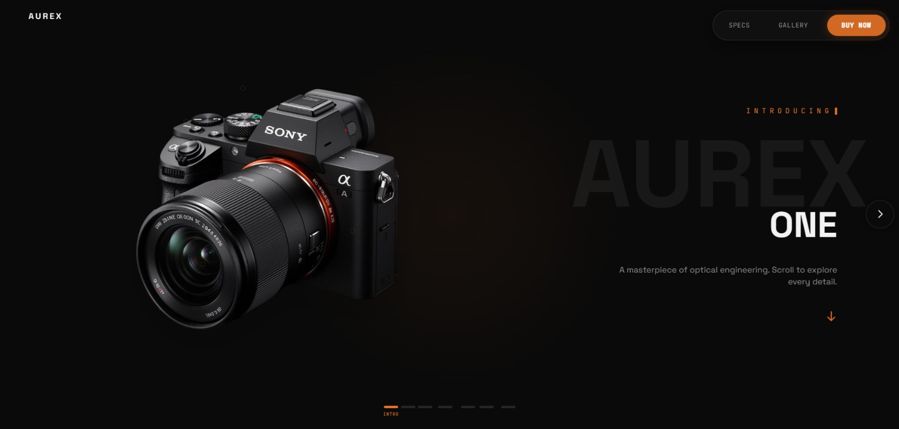
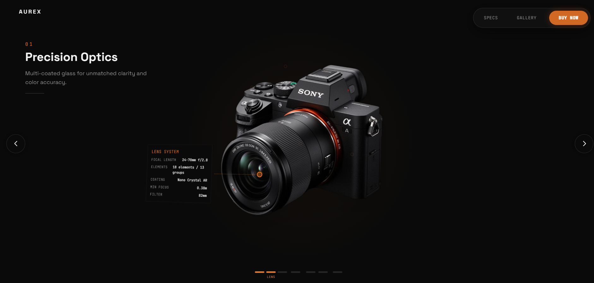
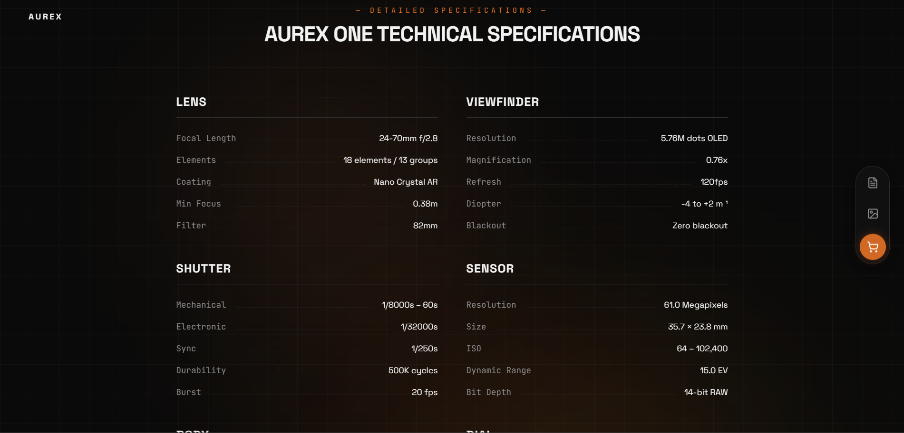
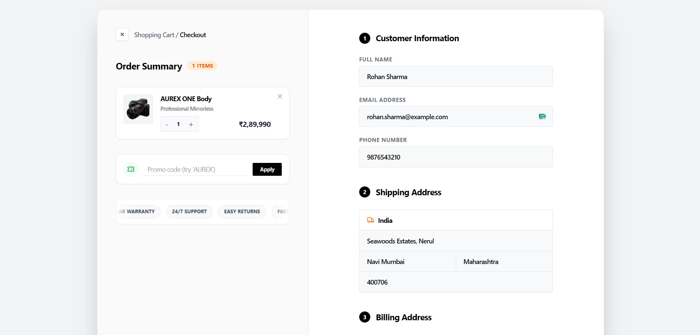
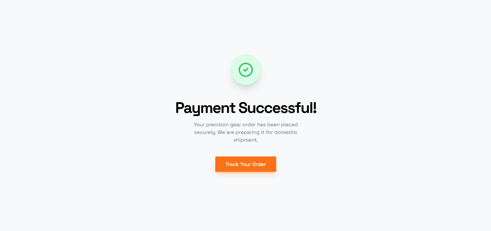

# AUREX ONE — Premium Camera Product Platform

> A fully functional, responsive e-commerce platform for a premium mirrorless camera. Built with React, TypeScript, Tailwind CSS, and Razorpay payment integration.

## 🔗 Live Demo

**Live URL:** [https://camera-product-page-nine.vercel.app](https://camera-product-page-nine.vercel.app)  
**GitHub Repository:** [https://github.com/biswa220124/cameraProductPage](https://github.com/biswa220124/cameraProductPage)

---

## 📸 Screenshots

### Hero / Landing Page


### Scroll-Driven 3D Camera Experience


### Technical Specifications Section


### Checkout Page


### Payment Success


---

## 🛠️ Technologies Used

| Technology | Purpose |
|---|---|
| **React 18** | UI framework |
| **TypeScript** | Type-safe development |
| **Vite** | Build tool & dev server |
| **Tailwind CSS** | Styling & responsive layout |
| **React Router v6** | Client-side routing |
| **GSAP** | Scroll-triggered 3D animations |
| **Lucide React** | Icon library |
| **Razorpay** | Payment gateway (test mode) |
| **Vercel Analytics** | Page view & visitor tracking |

---

## 📦 Project Structure

```
src/
├── assets/
│   └── camera-main.png         # Product hero image
├── components/
│   ├── AnnotationOverlay.tsx   # Camera part annotations
│   ├── ProgressBar.tsx         # Scroll progress indicator
│   └── ui/
│       ├── AurexFooter.tsx     # Footer with gallery & community
│       └── ...                 # Shadcn UI components
├── pages/
│   ├── Index.tsx               # Landing page (main)
│   ├── Checkout.tsx            # Order summary + payment
│   └── TrackOrder.tsx          # Order tracking page
└── main.tsx
```

---

## ⚙️ Setup Instructions

### Prerequisites
- Node.js v18+ 
- npm v9+

### 1. Clone the repository
```bash
git clone https://github.com/yourusername/aurex-one.git
cd aurex-one
```

### 2. Install dependencies
```bash
npm install
```

### 3. Run the development server
```bash
npm run dev
```

The app will be available at **http://localhost:8080**

### 4. Build for production
```bash
npm run build
```

---

## 💳 Payment Gateway Integration (Razorpay)

### Setup
The project uses **Razorpay in Test Mode** — no real money is charged.

**Razorpay Test Key:** `rzp_test_ScRW13ONeYNHKj`

### Payment Flow
1. User selects product → clicks "Buy Now" → navigates to `/checkout`
2. Checkout page displays order summary with cart items, discounts, and total
3. User fills in customer details (name, email, phone) and shipping address
4. User clicks **"Pay ₹X"** → Razorpay checkout modal opens
5. On success → order is saved to `localStorage` → success screen shown
6. On failure → error alert with Razorpay error description

### Testing Without Backend
A **"Demo — Simulate Successful Payment"** button is available on the checkout page to test the full success flow without needing the backend server running.

### Backend Requirements (for real Razorpay flow)
The real Razorpay integration requires a backend server with:
- `POST /create-order` — creates a Razorpay order and returns `order_id` and `amount`
- `POST /verify-payment` — verifies the payment signature using Razorpay's secret key

### Discount Code
- Use promo code **`AUREX`** at checkout for 10% off

---

## 📊 Analytics Implementation

This project uses **Vercel Analytics** for tracking:
- Page views
- Unique visitors
- Traffic sources / referrers
- Country & device breakdown

Analytics are loaded via the script tag in `index.html`:
```html
<script defer src="/_vercel/insights/script.js"></script>
```

Analytics are automatically activated upon Vercel deployment — no additional API keys or configuration needed.

---

## 🧩 Key Features

### Landing Page (`/`)
- **Welcome screen** with animated entrance on first visit
- **Scroll-driven 3D camera animation** — 6 camera components highlighted with annotations
- **Technical specifications** sheet with 6 data categories
- **Accessories section** — 5 products with popup detail modals and Add to Cart
- **Testimonials carousel** — 7 customer reviews
- **Contact form**- Just Impleneted the frontend backend is not connected
- **Photo gallery** — "Captured by Our Community" section with parallax
- **Responsive design** — optimized for mobile, tablet, and desktop
- **Footer Section**- Many options are just static but can be connected to backend for realworld use

### Mobile-Specific
- Fixed feature text animation (left-to-right slide instead of vertical)
- Mobile bottom action bar (Specs / Gallery / Buy Now)
- Scroll-aware UI hiding (bar hides at footer)

### Checkout Page (`/checkout`)
- Full order summary with item quantity management
- Promo/discount code input
- Customer info form (name, email, phone)
- Shipping & billing address forms
- Razorpay payment integration
- Order success screen with track order CTA

### Order Tracking (`/track-order`)
- Reads order from localStorage
- Displays order ID, payment ID, items, and status

---

## 🚀 Deployment

### Deploy to Vercel (Recommended)

1. Install Vercel CLI:
```bash
npm install -g vercel
```

2. Deploy:
```bash
vercel
```

3. Follow the prompts — Vercel will auto-detect Vite and configure the build.

**Live URL:** https://camera-product-page-nine.vercel.app

### Environment Variables
No environment variables are required for the demo/test mode.

---

## 📋 Assignment Checklist

| Requirement | Status |
|---|---|
| Hero section with CTA | ✅ |
| 3–6 products with title, price, buy button | ✅ (6 items) |
| Payment gateway integration (Razorpay test mode) | ✅ |
| User details before payment | ✅ |
| Success & failure transaction handling | ✅ |
| Order summary / checkout section | ✅ |
| Testimonials section (3+ entries) | ✅ (7 entries) |
| Contact form with validation | ✅ |
| Footer with nav + social icons | ✅ |
| Fully responsive (mobile/tablet/desktop) | ✅ |
| Analytics integration | ✅ (Vercel Analytics) |
| Deployment | ✅ (Vercel) |
| README with setup + payment notes | ✅ |

---

## 📄 Legal & Disclaimer

**Educational Purpose Only**: This project is created strictly for educational/assignment evaluation purposes. 

**Copyright Disclosure**: The 3D camera render/image used in this project features a **Sony Alpha** series camera. All rights, trademarks, and copyrights associated with the camera design, logo, and brand belong solely to **Sony Corporation**. This project does not claim any ownership over these assets and is not affiliated with, endorsed by, or sponsored by Sony. No commercial use is intended.
